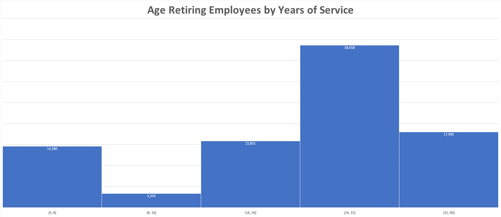
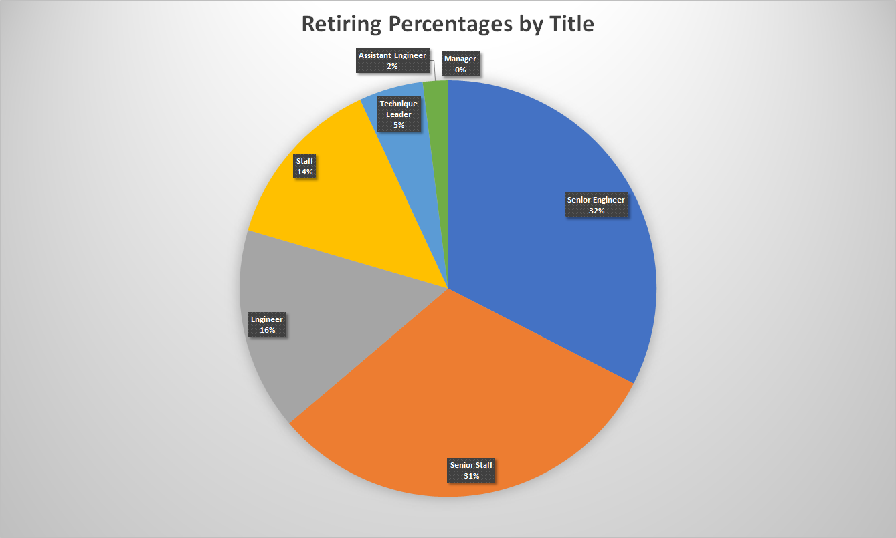
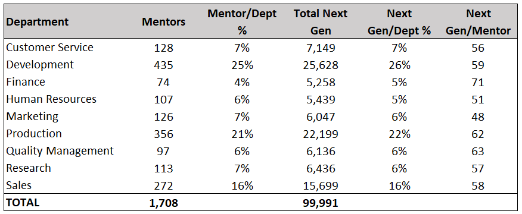

# Pewlett-Hackard-Analysis
Data Analytics Boot Camp - Module 7 SQL

## Overview of the analysis

As many employees at **Pewlett-Hackard** are about to reach retirement age, the purpose of this analysis is to determine the number of retiring employees per title and identify employees who are eligible to participate in a mentorship program.

## Results

Below are four major points resulted from the two analyses conducted:
1. There are ***133,776*** employees in the retirement_titles table. Several of these employees held multiple titles throughout the years. Counting the distinct employees only, that number is reduced to ***90,398*** employees
2. Using Excel’s pivot tables and some data manipulation, we find that ***43%*** of eligible of retirement employees have worked in **PH** between ***24*** and ***32*** years and only ***4%*** have worked for ***8*** to ***16*** years

3. Based on the ***retiring_titles*** table, we can see that most titles are Senior Engineers and least are managers

4. First we made sure the *mentorship query* sorts the ***to_date*** from the ***titles*** table descending order so we get the latest title for each employee. Then after analyzing the ***mentorship_eligibilty*** table and using today’s date, April 10th, 2021, we can conclude that the average (mean) years of service for mentors is: ***28*** years

## Summary

### - How many roles will need to be filled as the "silver tsunami" begins to make an impact?

By looking at the ***retiring_titles*** table, we can confirm that the number is ***90,398*** employees which is the same number as roles need to be filled

### - Are there enough qualified, retirement-ready employees in the departments to mentor the next generation of Pewlett Hackard employees?

Based on ***query 1*** below, which gets the total number of employees eligible for retirement per department (next generation employees), and ***query 2*** which gets the total number of eligible mentors per department, we find that we have approximately the same percentage of mentors per department as the percentage of next generation employees per department, which tells us that we should be fine with the number of mentors per department. Please see image below:

#### **Query 1**

-- Total eligible for retirement employees per department

SELECT

	dp.dept_name AS "Department",

	COUNT(emp.emp_no) AS "Total Employees"

FROM Employees AS emp

INNER JOIN dept_emp AS de

ON emp.emp_no = de.emp_no

INNER JOIN Departments AS dp

ON de.dept_no = dp.dept_no

WHERE (emp.birth_date BETWEEN '1952-01-01' AND '1955-12-31')

GROUP BY dp.dept_name

ORDER BY "Total Employees" DESC;

#### **Query 2**

-- Total mentors per department

SELECT 

	dt.dept_name AS "Department",

	COUNT(me.emp_no) AS "Total Mentors"

FROM mentorship_eligibilty AS me

INNER JOIN dept_emp AS de

ON me.emp_no = de.emp_no

INNER JOIN Departments AS dt

ON de.dept_no = dt.dept_no

GROUP BY dt.dept_name

ORDER BY "Total Mentors" DESC;

---

